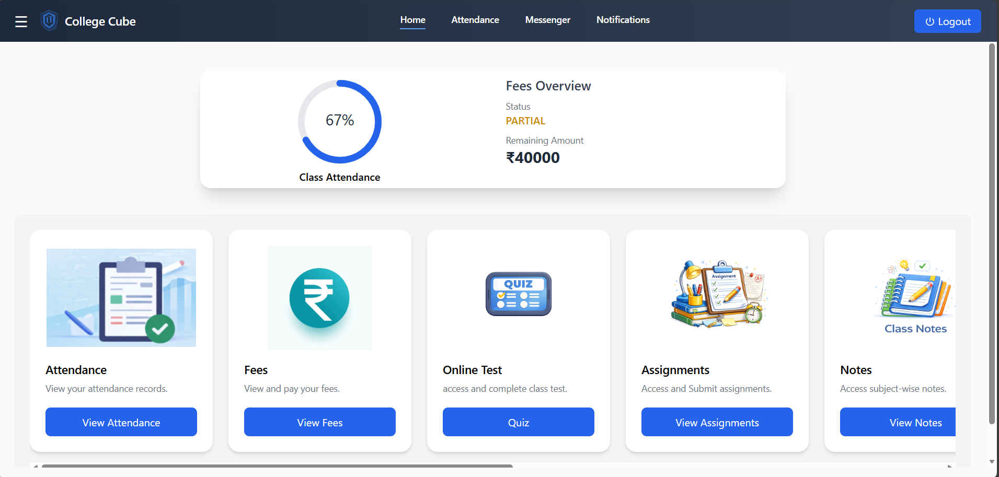
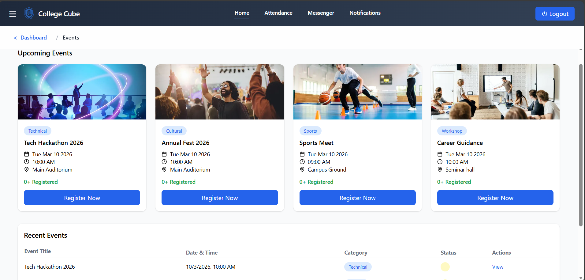
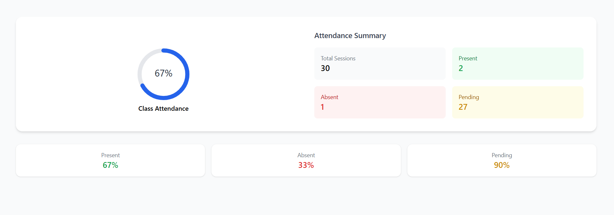
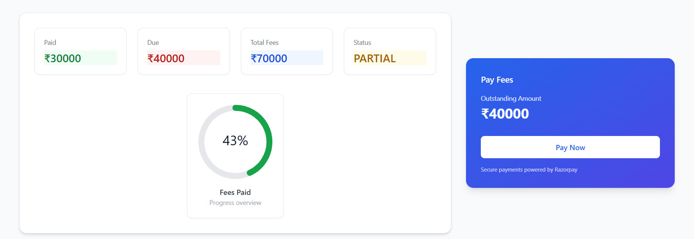
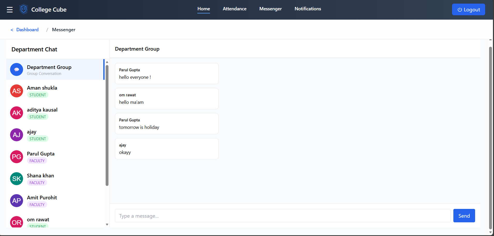
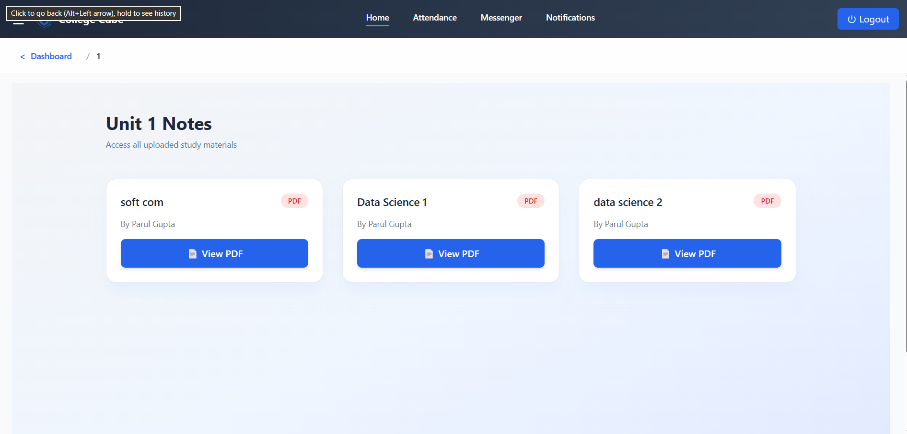

# 🎓 College Cube – Multi-College SaaS ERP System

College Cube is a full-stack MERN-based College ERP platform designed using a multi-college SaaS architecture.  

Each Admin represents a college.  
Data isolation is strictly maintained using `collegeId` across the system.

The platform supports three roles:
- ADMIN
- FACULTY
- STUDENT

---

## 🚀 Key Features

### 👨‍💼 Admin (College Owner)
- College-based SaaS signup
- Manage Departments
- Create Faculty & Students
- Event Management System
- Fees Management (Razorpay Integration)
- Attendance Monitoring
- Real-time Department Messenger
- Role-based dashboard

### 👨‍🏫 Faculty
- Mark Attendance (30-Day Cycle System)
- View Student Attendance Summary
- Participate in Department Chat
- View College Events

### 👨‍🎓 Student
- View Attendance Summary
- Pay Fees via Razorpay
- Register for Events
- Real-time Messaging
- View Notes (Department → Subject → Unit)

---

## 🏗 Architecture Highlights

- Multi-College SaaS Architecture
- Strict Role-Based Access Control
- JWT contains:
  - userId
  - role
  - collegeId
- Separate Models:
  - User
  - Student
  - Faculty
  - College
- 30-Day Attendance Auto Reset System
- College-Level Data Isolation
- Real-Time Chat using Socket.io
- Razorpay Payment Verification
- Cloudinary File Upload System

---

## 🛠 Tech Stack

### Frontend
- React + Vite
- Tailwind CSS
- Axios
- Redux
- Socket.io-client
- React Circular Progressbar

### Backend
- Node.js
- Express.js
- MongoDB + Mongoose
- JWT Authentication
- Role-Based Middleware
- Razorpay Integration
- Cloudinary
- Socket.io

---

## 📂 Project Structure

```
frontend/
backend/
screenshots/
README.md
```

---

## ⚙️ Installation & Setup

### 1️⃣ Clone Repository

```bash
git clone https://github.com/YOUR_USERNAME/college-cube-erp.git
cd college-cube-erp
```

---

### 2️⃣ Backend Setup

```bash
cd backend
npm install
npm run dev
```

---

### 3️⃣ Frontend Setup

```bash
cd frontend
npm install
npm run dev
```

---

## 🔐 Environment Variables

Create a `.env` file inside the **backend** folder:

```
MONGO_URI=
JWT_SECRET=
RAZORPAY_KEY_ID=
RAZORPAY_SECRET=
CLOUDINARY_NAME=
CLOUDINARY_API_KEY=
CLOUDINARY_SECRET=
```

⚠ Environment variables are excluded from the repository for security reasons.

---

## 📸 Screenshots

### 🔹 Admin Dashboard


### 🔹 Event Module


### 🔹 Attendance Module


### 🔹 Fees Module


### 🔹 Messenger


### 🔹 Notes


---

## 💡 Unique Design Decisions

- Admin Signup Automatically Creates College
- College-Based Data Isolation using `collegeId`
- Attendance Auto Reset After 30 Days
- JWT-Based Role & College Validation
- Modular Dashboard Layout System
- Clean Separation of Domain Models

---

## 📌 Future Improvements

- Department-Level Event Filtering
- Advanced Admin Analytics Dashboard
- Email Notification System
- PDF Report Generation

---

## 👨‍💻 Author

Ankit Singh Lodhi  
B.Tech IT (2022–2026)  
Full-Stack MERN Developer  

---

## ⭐ If you like this project

Give it a star on GitHub!